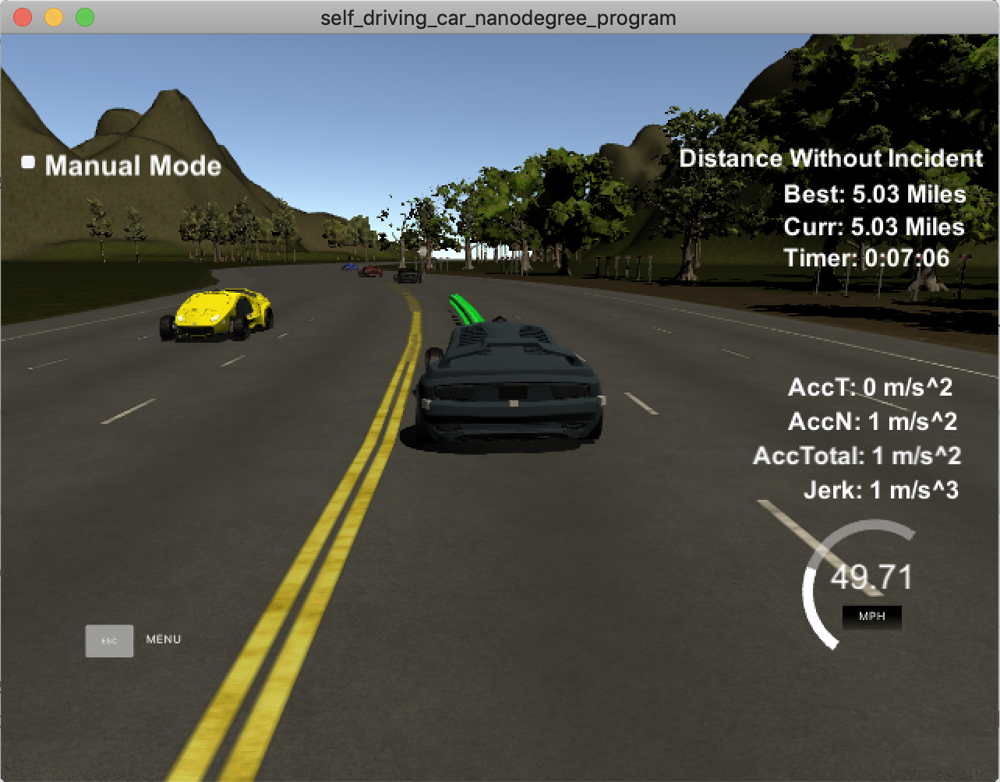

# CarND-Path-Planning

Self-Driving Car Engineer Nanodegree Program

## Goals

In this project your goal is to safely navigate around a virtual highway with other traffic that is driving +-10 MPH of the 50 MPH speed limit. You will be provided the car's localization and sensor fusion data, there is also a sparse map list of waypoints around the highway. The car should try to go as close as possible to the 50 MPH speed limit, which means passing slower traffic when possible, note that other cars will try to change lanes too. The car should avoid hitting other cars at all cost as well as driving inside of the marked road lanes at all times, unless going from one lane to another. The car should be able to make one complete loop around the 6946m highway. Since the car is trying to go 50 MPH, it should take a little over 5 minutes to complete 1 loop. Also the car should not experience total acceleration over 10 m/s^2 and jerk that is greater than 10 m/s^3.

#### Note:
Acceleration is calculated by comparing the rate of change of average speed over 0.2 second intervals. In this case total acceleration at one point was as high as 75 m/s^2. Jerk was also very high. The jerk is calculated as the average acceleration over 1 second intervals. In order for the passenger to have an enjoyable ride both the jerk and the total acceleration should not exceed 10 m/s^2. Minimize total acceleration and jerk by gradually increasing and decreasing point path spacing based on the car_speed variable.

#### The map of the highway is in data/highway_map.txt
Each waypoint in the list contains [x, y, s, dx, dy] values. x and y are the waypoint's map coordinate position, the s value is the distance along the road to get to that waypoint in meters, the dx and dy values define the unit normal vector pointing outward of the highway loop.

The highway's waypoints loop around so the frenet s value, distance along the road, goes from 0 to 6945.554.

## Path Planner Implementation Details (Project Rubric)

1. The car is able to drive at least 4.32 miles without incident: The top right screen of the simulator shows the current/best miles driven without incident. Incidents include exceeding acceleration/jerk/speed, collision, and driving outside of the lanes. Each incident case is also listed below in more detail.



2. The car drives according to the speed limit: The car doesn't drive faster than the speed limit. Also the car isn't driving much slower than speed limit unless obstructed by traffic.

- [x] This is achieved by maintaining the car's current speed (```car_speed```) to be equal to goal velocity (```goal_v```), which is determined using sensor fusion data, and max speed allowed for the car (```TOP_V = 49.5```).

3. Max Acceleration and Jerk are not exceeded: The car does not exceed a total acceleration of 10 m/s^2 and a jerk of 10 m/s^3.

- [x] The car's current speed (```car_speed```) is only increased or decreased by 0.1 m/s or 0.2237 MPH (```TO_MPH / 10```)

4. Car does not have collisions: The car must not come into contact with any of the other cars on the road.

- [x] The sensor fusion data for all other cars on the road is analyzed to avoid collisions. If there is a possibility of collision, the car has two options to avoid collision: if its safe, change lane, or slow down. First find the other car's lane (```main.cpp: Line 131 - 138```), and then locate this other car w.r.t. our car (```main.cpp: Line 140 - 156```). When a car is in front of our car, change lane if its safe, otherwise slow down (```main.cpp: Line 171 - 182```).

5. The car stays in its lane, except for the time between changing lanes: The car doesn't spend more than a 3 second length out side the lane lanes during changing lanes, and every other time the car stays inside one of the 3 lanes on the right hand side of the road.

- [x] When we are generating trajectory (spline) for our car, we use map waypoints at 30, 60, and 90 meters, and car's current lane to center our car within each lane (```main.cpp: Line 213 - 218```).

6. The car is able to change lanes: The car is able to smoothly change lanes when it makes sense to do so, such as when behind a slower moving car and an adjacent lane is clear of other traffic.

- [x] A lane change, left or right, is considered safe when there are no other cars, in the target lane, within 30 meters of our car (i.e. no car <30 meters in front or back). A lane change is only triggered when our car is behind a slower car (i.e. driving slower than the speed limit).

## Basic Build Instructions

1. Clone this repo.
2. Make a build directory: `mkdir build && cd build`
3. Compile: `cmake .. && make`
4. Run it: `./path_planning`.

Here is the data provided from the Simulator to the C++ Program

#### Main car's localization Data (No Noise)

["x"] The car's x position in map coordinates

["y"] The car's y position in map coordinates

["s"] The car's s position in frenet coordinates

["d"] The car's d position in frenet coordinates

["yaw"] The car's yaw angle in the map

["speed"] The car's speed in MPH

#### Previous path data given to the Planner

Note: Return the previous list but with processed points removed, can be a nice tool to show how far along
the path has processed since last time.

["previous_path_x"] The previous list of x points previously given to the simulator

["previous_path_y"] The previous list of y points previously given to the simulator

#### Previous path's end s and d values

["end_path_s"] The previous list's last point's frenet s value

["end_path_d"] The previous list's last point's frenet d value

#### Sensor Fusion Data, a list of all other car's attributes on the same side of the road. (No Noise)

["sensor_fusion"] A 2d vector of cars and then that car's [car's unique ID, car's x position in map coordinates, car's y position in map coordinates, car's x velocity in m/s, car's y velocity in m/s, car's s position in frenet coordinates, car's d position in frenet coordinates.

## Details

1. The car uses a perfect controller and will visit every (x,y) point it recieves in the list every .02 seconds. The units for the (x,y) points are in meters and the spacing of the points determines the speed of the car. The vector going from a point to the next point in the list dictates the angle of the car. Acceleration both in the tangential and normal directions is measured along with the jerk, the rate of change of total Acceleration. The (x,y) point paths that the planner recieves should not have a total acceleration that goes over 10 m/s^2, also the jerk should not go over 50 m/s^3. (NOTE: As this is BETA, these requirements might change. Also currently jerk is over a .02 second interval, it would probably be better to average total acceleration over 1 second and measure jerk from that.

2. There will be some latency between the simulator running and the path planner returning a path, with optimized code usually its not very long maybe just 1-3 time steps. During this delay the simulator will continue using points that it was last given, because of this its a good idea to store the last points you have used so you can have a smooth transition. previous_path_x, and previous_path_y can be helpful for this transition since they show the last points given to the simulator controller with the processed points already removed. You would either return a path that extends this previous path or make sure to create a new path that has a smooth transition with this last path.

## Tips

A really helpful resource for doing this project and creating smooth trajectories was using [this](http://kluge.in-chemnitz.de/opensource/spline/), the spline function is in a single hearder file is really easy to use.

## Simulator

You can download the Term3 Simulator which contains the Path Planning Project from the [releases](https://github.com/udacity/self-driving-car-sim/releases/tag/T3_v1.2).

To run the simulator on Mac/Linux, first make the binary file executable with the following command:
```shell
sudo chmod u+x {simulator_file_name}
```

## Dependencies

* cmake >= 3.5
  * All OSes: [click here for installation instructions](https://cmake.org/install/)
* make >= 4.1
  * Linux: make is installed by default on most Linux distros
  * Mac: [install Xcode command line tools to get make](https://developer.apple.com/xcode/features/)
  * Windows: [Click here for installation instructions](http://gnuwin32.sourceforge.net/packages/make.htm)
* gcc/g++ >= 5.4
  * Linux: gcc / g++ is installed by default on most Linux distros
  * Mac: same deal as make - [install Xcode command line tools]((https://developer.apple.com/xcode/features/)
  * Windows: recommend using [MinGW](http://www.mingw.org/)
* [uWebSockets](https://github.com/uWebSockets/uWebSockets)
  * Run either `install-mac.sh` or `install-ubuntu.sh`.
  * If you install from source, checkout to commit `e94b6e1`, i.e.
    ```
    git clone https://github.com/uWebSockets/uWebSockets
    cd uWebSockets
    git checkout e94b6e1
    ```

## Code Style

Please (do your best to) stick to [Google's C++ style guide](https://google.github.io/styleguide/cppguide.html).

## Project Instructions and Rubric

Note: regardless of the changes you make, your project must be buildable using
cmake and make!

## References
https://github.com/awbrown90/CarND-Path-Planning-Project

https://medium.com/intro-to-artificial-intelligence/path-planning-project-udacitys-self-driving-car-nanodegree-be1f531cc4f7
